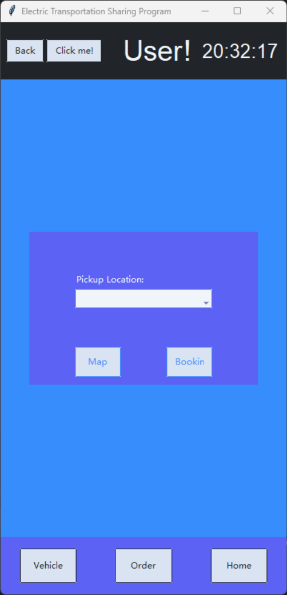
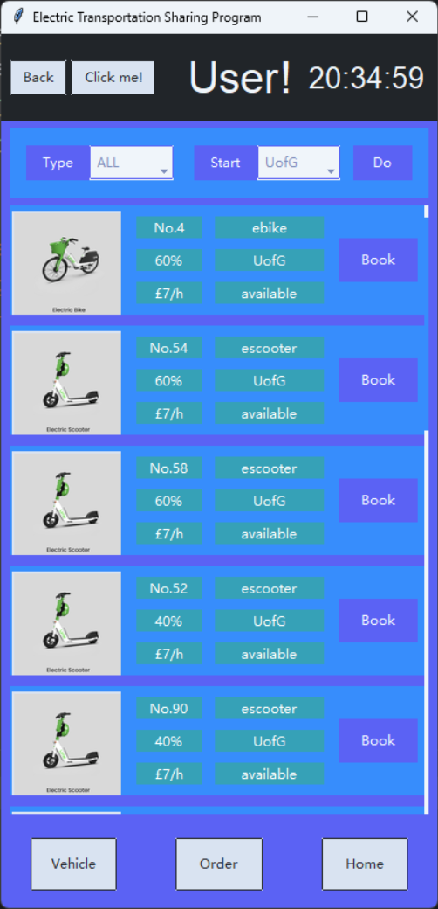
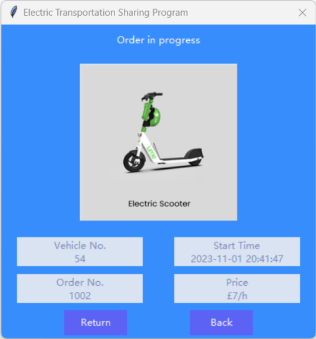
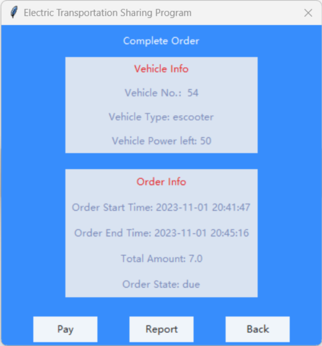
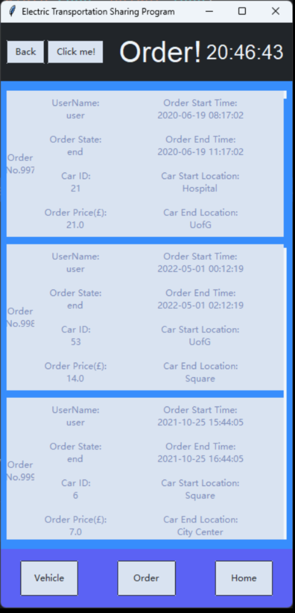
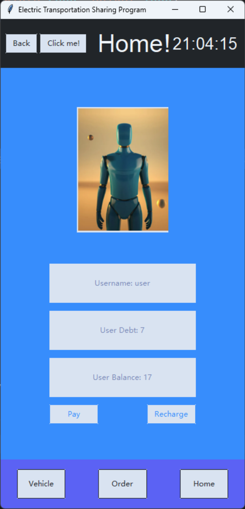

# Electric Transportation Sharing Program
***
## Description
This software system is designed to support an electric vehicle share program. It completed a functioning end-to-end prototype and could demonstrate it with appropriate data. It contains three main parts for different groups: for customers(an interface to reserve and return vehicles and to pay), for operators(to assess the state of the vehicles in the system and make changes), and for managers(to view usage reports).

## Visuals
* login

* customer page

* booking page

* order in program

* complete order

* order

* home page

* operator system

* manager login

* manager system: vehicle list

* manager system: vehicle list based on descending

* manager system: vehicle info visualization

* manager system: vehicle info visualization - calendar 

* manager system: vehicle info visualization based on selected date

* 

## Installation
There are several libraries should be installed before using this software:
* os
* random
* sqlite3
* string
* datetime
* pandas
* tkinter
* math
* PIL
* matplotlib
* pathlib

IMPORTANT: you have to install before start:
* ttkbootstrap

## Usage
* Run the main file 
* Test account name and password:

| account type |   name   | password|
|:------------:|:--------:| :---: |
|   customer   |   user   | 000 |
|   operator   | operator | 000 |
|   manager    | manager  | 000 |

## Functions
* Technical framework 
  * Full-stack Development: The project spans full-stack development from frontend interfaces to backend databases. 
  * User Interface: Implemented using tkinter and ttkbootstrap, featuring complex graphical user interfaces with various interactive elements. 
  * Database Handling: Utilizes SQLite for managing user and vehicle data, integrated with pandas for data processing and querying. 
  * Multiple User Roles: The project is designed with several user roles (customers, operators, managers), each having distinct interfaces and functionalities. 
  * Visualisation scheme: using the scheme of matplotlib combined with pandas, the information in the database will be displayed in the tkinter GUI interface by suitable methods 
* Frameworks and Platforms Used 
  * Frontend Framework: tkinter and ttkbootstrap, for building graphical user interfaces. 
  * Database: SQLite, for data storage and management. 
  * Data Processing: pandas, for data analysis and manipulation. 
  * Image generation: matplotlib, used to convert data into suitable images 
  * Data flow:
    * Users interact with the system through the front-end interface. 
    * The back-end is responsible for processing user requests and interacting with the database to obtain or update data. 
    * The database stores all relevant information, including user information, vehicle status and order data. 
* Logical initial database data:
The back-end database is generated according to the following rules:
* tb_users. 
  * random name with a password that meets a certain strength specification 
  * random user type, user owed, current location 
* tb_cars. 
  * random vehicle types 
  * one price per vehicle type 
  * random battery percentage at intervals of 10 
  * carState may be 'available', 'inrent', 'lowpower', 'repair', if power is less than 20, then set CarState to lowpower 
  * RepairDetail value may not be null only if CarState value is repair. 
* tb_orders. 
  * Randomly generate the initial time for the selected year range in %Y-%m-%d %H:%M:%S format. 
  * Add a random number of hours and minutes to generate the end time. 
  * random user and vehicle ID 
  * order price = vehicle hourly unit price * order duration 
  * the same user can have many orders with 'end' status, but can only have at most one order with 'due' or one order with 'going' status. 
* Page presentation and corresponding technical implementation 
  * login page
    * Using a whole class 'ETSP' for page presentation 
    * Styling via ttkbootstrap 
    * The page is divided into three frames - upper, middle and lower - for presentation and for subsequent code reuse and page updates. 
    * Using the datatime package to display real-time 
  * customer page 
    * All appearing windows have been centred to ensure that they are displayed in the centre of the screen regardless of the size of the newly generated window. 
    * Clearing, updating and restoring pages with the place_forget function 
    * Generate static image window when clicking Map 
    * Input Detection: Prompts when the customer has not entered a location 
  * booking page
    * The user can filter the vehicles based on the selected vehicle type and the start location (which can be adjusted), and by default the vehicles are sorted in descending order of electricity usage. The way to implement this is to use pandas statement to get the whole database and store it as DataFrame type, and then get the required data by list cut. 
    * The lower side of the available vehicle information can be slid to display the page, the way to achieve this is to create a Canvas widget in the lower part, associated with the vertical scroll bar, and set when the configuration of the lower side of the Frame changes, the on_canvas_configure function will be called to automatically adjust the scrolling area of the Canvas. In the lower side Frame area, loop through the pack function to place a 'card' function containing the display information as shown: image, vehicle information, Book button. 
    * Logical judgement will be made after clicking on the car selection, if the current user has neither orders in progress nor unpaid orders, the lock will be unlocked successfully and the 'Order in progress' interface will be generated, which shows some details of this order. 
    * If you leave this screen at this point, the order will be marked as on-going, and if the user books another car, you will be prompted with the appropriate message and be redirected to the Order in progress screen. Clicking the Return button at this point will return the vehicle and take the user to the Pay/Report screen.
    * This screen displays some detailed information about the vehicle and the order. From this screen, you can make a payment or report a problem with the vehicle. 
  * Click Order on the main screen to enter the order history screen. 
    * The generation principle is similar to the previous vehicle interface, which is generated cyclically by calling the 'card' function and placed into the frame. 
  * Click the Home button to enter your personal homepage 
    * You can see the basic information of the current user in your personal homepage, pay for unpaid orders and top up your account. 
  * Return to the login screen and enter the operator test account to log into the operator page. The programme can automatically detect the type of user from the database based on the user name entered and enter the corresponding screen. 
  * Several different filtering and sorting modes are seen at the top of the interface, which are placed in the top frame for more precise filtering and sorting for the operator. 
    * The tabs have been set to their default values. This is because if too many eligible vehicles are selected, it can cause slow loading. The implementation logic is still based on DataFrame for cutting operations. 
    * There are three buttons on the right side of each vehicle information card. When Charge is clicked, the battery is charged and the database is updated in real time via SQL statements. After that, the current display will be refreshed and the information will be updated. repair works in a similar way, it will clear the repairDetail and update the vehicle status to available or lowpower (depending on the battery level). In particular, if the vehicle is currently in REPAIR status, it cannot be charged and a message will be displayed. 
    * Clicking on the Move button unlocks the vehicle and selects a new address to simulate moving the vehicle to. 
  * Go back to the login screen and log in using the manager test account
    * b)This will show a fully functional manager backend system. In the Vehicle List interface, using the TreeView control in conjunction with DataFrame table manipulation, you can directly display a full list of vehicle information and sort it by selected columns in ascending or descending order for the administrator to process the information. The width of each column is calculated automatically by the function 
    * In the vehicle information visualisation interface, you can see the statistical information of the currently registered vehicles. Including the remaining power statistics of all current vehicles, total mileage statistics, vehicle type distribution, vehicle status distribution and current vehicle location distribution map. The realisation process is to generate the relevant data into pictures through matplotlib library, and use FigureCanvasTkAgg to connect Tkinter and Matplotlib, so that the pictures generated by matplotlib can be embedded into the front-end of Tkinter. 
    * Clicking on the Time Selection button above and clicking on Confirm generates some charts that are more useful in actual company operations, with the image on the left showing statistics on the number of orders originating and terminating in that timeframe, and on the right, route heat statistics. These statistics are particularly useful for the company to make decisions about the location and number of vehicles to be placed.

## Roadmap
In future app versions, we will improve our product in the following areas: 
* Adding multi-language functionality to accommodate users from different 
countries. 
* Adding handling and GUI display related to vehicle retirement and the 
addition of new vehicles. 
* Adding new user management features, such as considering the addition of a 
membership system and the distribution of coupons. 
* Improvement of the administrator system. The expected functionality to be 
realized is as follows:
  * User management 
  * User list 
  * Filtering /adding /editing /deleting /viewing information /sorting /excellike horizontal bar filling to indicate size. 
* User-specific information interface (like personal homepage)
* Information visualization 
* Registration growth /activity (number of times used within a specified period) 
/current user arrears. 
* Operator management 
* Operator list
a) Filtering /adding /editing /deleting /viewing information /sorting /excel like horizontal bar padding to indicate size. 
* Vehicle management (already achieved)
* Order Management 
* Order list (filtering, sorting)
  * company income statement 
* One-click export of infographics to PDF files 
* Make operator /manager's back button an image.

## Authors

| Name	| Member roles and responsibilities                                                                                                                                                                                                                                                                                                                                                                                                                                                                                                                                                                                                                                                                                                                                                                                                                                                                                                                                                                                                                                                                                                                                                                                                                                                                                                                                                                                                                                                                                                                                                                                                                                                                                                                                                                                                                                                                                                                                                                                                                                                                                                                                                                                                                                                                                                                                                                                                                                                                                                                                                   |
|:------------:|:------------------------------------------------------------------------------------------------------------------------------------------------------------------------------------------------------------------------------------------------------------------------------------------------------------------------------------------------------------------------------------------------------------------------------------------------------------------------------------------------------------------------------------------------------------------------------------------------------------------------------------------------------------------------------------------------------------------------------------------------------------------------------------------------------------------------------------------------------------------------------------------------------------------------------------------------------------------------------------------------------------------------------------------------------------------------------------------------------------------------------------------------------------------------------------------------------------------------------------------------------------------------------------------------------------------------------------------------------------------------------------------------------------------------------------------------------------------------------------------------------------------------------------------------------------------------------------------------------------------------------------------------------------------------------------------------------------------------------------------------------------------------------------------------------------------------------------------------------------------------------------------------------------------------------------------------------------------------------------------------------------------------------------------------------------------------------------------------------------------------------------------------------------------------------------------------------------------------------------------------------------------------------------------------------------------------------------------------------------------------------------------------------------------------------------------------------------------------------------------------------------------------------------------------------------------------------------|
|   Tianpeng Qiu   | 1.  Analyze requirements, design three different user classes, two vehicle classes, and an order class based on the requirements(including attributes and functions).   2. Perform database analysis and design a database initialization program based on the analysis results. Use SQLite3 to build the "estp_database.db" which includes three tables: "tb_Users," "tb_Cars," and "tb_Orders." Initialize the data, provide test user, and test vehicle data. The development result is the "InitializeDatabase.py" file.   3. Design database functionality, responsible for low level data interactions, including functions for adding, deleting, modifying, and querying data in the three data tables. The development result is the "Sql_Function.py" file.   4. Design backend functionality, implement backend logic for requirements based on database functionality, and return the appropriate database query results according to the requirements. The development result is the "BE_Function.py" file.   5. Collaborate with the frontend for GUI-Data integration, ensuring that data is displayed correctly in the user interface.   6. Design test cases and conduct black-box testing based on the test cases.                                                                                                                                                                                                                                                                                                                                                                                                                                                                                                                                                                                                                                                                                                                                                                                                                                                                                                                                                                                                                                                                                                                                                                                                                                                                                                                                  |
|   Mingrui Liu   | 1.  Prototype Design: Create prototypes, primarily for the GUI front-end interaction design of the administrator and operator interfaces. This includes sketches and the implementation of relevant functions.   2. Front-End Development: Write front-end code to implement operations for the administrator and operator interfaces. Build a GUI interface, including how to display fixed interfaces and how to close the previous interface when opening a new one, with the ability to return to the previous interface. The development results are included in "BE_Function.   3. Collaboration with Back End: Work in collaboration with the back end to complete the implementation of relevant functions and establish connections with the database                                                                                                                                                                                                                                                                                                                                                                                                                                                                                                                                                                                                                                                                                                                                                                                                                                                                                                                                                                                                                                                                                                                                                                                                                                                                                                                                                                                                                                                                                                                                                                                                                                                                                                                                                                                                                |
|   Chenrui Li    | 1.	Framework design: code using the form of class implementation, the main use of pandas table data operations, tkinter theme selection.   2.	Front- end design: most of the specific implementation of the front-end code (FE_bs.py file), visual programmed selection and implementation, user/operator/manager front-end style unity and code reuse.   3.	Database initialisation design: logical generation of accurate database initialisation data (pdsql.py file)   4.	Front-end and back-end combination: with the back-end with the database operations                                                                                                                                                                                                                                                                                                                                                                                                                                                                                                                                                                                                                                                                                                                                                                                                                                                                                                                                                                                                                                                                                                                                                                                                                                                                                                                                                                                                                                                                                                                                                                                                                                                                                                                                                                                                                                                                                                                                                                                                           |
|Pei Ren| Product Side Contributions   ● Requirement Document Framework Establishment: Facilitated accurate documentation and accessibility of all product requirements, with a focus on the detailed division of functional and non-functional aspects.   ● Product Class Diagrams and Process Flowcharts Creation: Developed comprehensive diagrams depicting system structure and processes, ensuring clarity in architectural guidance and product logic.   ● Competitive Market Analysis: Conducted market research and analysis to identify competitor strengths and weaknesses, aiding product strategy formulation.   ● User-End Prototype Design: Designed intuitive and usable prototype diagrams for the user interface, including layout and interaction flows.   Technical Side Contributions   ● Mobile User Front-End Development: Implemented responsive design for the mobile application, ensuring user experience across various devices, supported by the latest front-end technologies.   ● Test Case Framework Establishment: Created a comprehensive framework for unit and integration testing, enhancing code quality and application reliability.|
